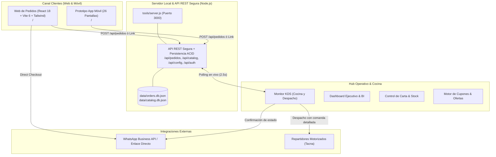
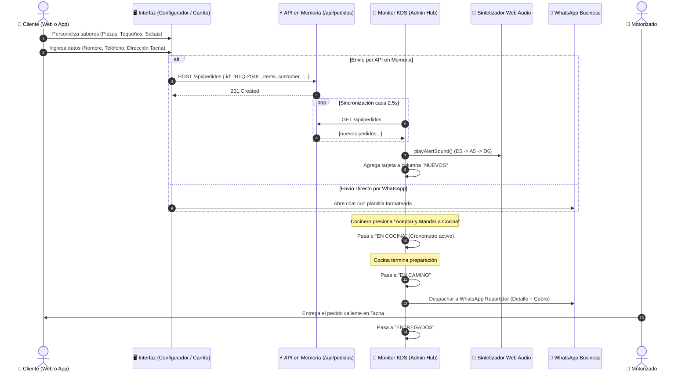

# Arquitectura del Sistema · Retequeños OS

Documento oficial de arquitectura técnica, diagrama de carpetas, flujo de datos y separación de responsabilidades para el ecosistema digital de **Retequeños** (Tacna, Perú).

---

## 1. Visión General del Ecosistema

Retequeños OS se compone de 3 capas principales integradas:



---

## 2. Diagrama de Carpetas Maestro (Árbol Completo)

```
RETEQUE-OS-main/
│
├── Compilar web.cmd                     # Compilación TypeScript + Vite con Node integrado
├── Iniciar app (celular).cmd            # Inicia servidor local en puerto 3000 y publica en LAN
├── Iniciar web.cmd                      # Sirve web/dist en http://localhost:5173
├── README.md                            # Guía rápida de inicio y bienvenida
├── Propuesta_Final_Ecosistema_...pdf    # Propuesta comercial y técnica Retequeños 2026
│
├── documentacion/                       # 📁 CENTRO DE DOCUMENTACIÓN TÉCNICA
│   ├── README.md                        # Índice de documentación
│   ├── ARQUITECTURA_Y_SISTEMA.md        # [ESTE ARCHIVO] Arquitectura y diagramas
│   ├── MEJORAS.md                       # Catálogo de 60 mejoras aplicadas (App y Web)
│   ├── CAMBIOS_KDS_REDISENO.md          # Registro del rediseño del monitor KDS
│   ├── CAMBIOS_DASHBOARD_REDISENO.md    # Registro de métricas BI y dashboard ejecutivo
│   ├── CAMBIOS_CUPONES_OFERTAS.md       # Registro del motor de cupones y planificador
│   ├── PLAN_IMPLEMENTACION_KDS_...md    # Especificación original de requerimientos KDS
│   └── RETEQUENOS_PROTOTIPO_FRONT_...md # Especificación del frontend de la web
│
├── app/                                 # 📁 HUB OPERATIVO & PROTOTIPO APP MÓVIL
│   ├── admin.html                       # Shell HTML semántico del Panel Admin (1,841 líneas)
│   ├── index.html                       # Shell del prototipo móvil navegable (26 pantallas)
│   ├── support.js                       # Motor declarativo reactivo para prototipo móvil
│   ├── assets/                          # Logotipos y recursos de marca
│   │   └── logo-retequenos.png
│   ├── img/                             # Galería de carta real (tequeños, pizzas, promos)
│   │   ├── hero-banner.jpg
│   │   ├── products/
│   │   └── promos/
│   │
│   ├── css/                             # 🎨 ARQUITECTURA MODULAR DE ESTILOS ADMIN & APP
│   │   ├── admin.css                    # Hoja maestra con importaciones por dominio
│   │   ├── mobile.css                   # Keyframes y media queries del prototipo móvil
│   │   └── admin/
│   │       ├── variables.css            # Tokens de diseño, paleta oficial, radios y sombras
│   │       ├── base.css                 # Reset tipográfico y viewport
│   │       ├── layout.css               # Sidebar de 270px, Header fijo y Main wrapper
│   │       ├── components.css           # Botones, switches, modales, tablas y toasts
│   │       ├── dashboard.css            # Gráficos Chart.js, KPIs, mapa y live ops feed
│   │       ├── kanban.css               # Tablero KDS, ticket cards, cronómetros y semáforos
│   │       └── promos.css               # Planificador semanal, mockup de teléfono y cupones
│   │
│   └── js/                              # ⚙️ ARQUITECTURA MODULAR JAVASCRIPT
│       ├── admin/
│       │   ├── app.js                   # Orquestador principal, navegación de tabs y reloj KDS
│       │   ├── data/
│       │   │   ├── catalog.data.js      # Catálogo oficial 2026 y control de stock
│       │   │   ├── coupons.data.js      # Cupones activos y agenda semanal de promociones
│       │   │   ├── orders.data.js       # Comandas KDS iniciales y estado en memoria
│       │   │   └── analytics.data.js    # Ventas, feedback, origen de tráfico y encuestas
│       │   ├── services/
│       │   │   ├── audio.service.js     # Web Audio API para alertas sonoras automáticas
│       │   │   ├── toast.service.js     # Notificaciones flotantes en pantalla
│       │   │   └── sync.service.js      # Polling en tiempo real con /api/pedidos (2.5s)
│       │   └── modules/
│       │       ├── dashboard.module.js  # Curva de ventas, donuts y productos top
│       │       ├── kanban.module.js     # Tablero KDS, avance de comanda y modal de detalle
│       │       ├── catalog.module.js    # CRUD de carta, categorías y switch de stock
│       │       ├── promos.module.js     # Motor de promociones, vista previa y exportación CSV
│       │       ├── customers.module.js  # Segmentación y estudio de notificaciones push
│       │       └── surveys.module.js    # Encuestas post-pedido, reseñas y filtro de estrellas
│       └── mobile/
│           └── data.js                  # Configuración de tienda, catálogo y rutas móviles
│
├── web/                                 # 📁 WEB DE PEDIDOS (REACT 18 + VITE 6 + TAILWIND)
│   ├── index.html                       # Entrada SPA Vite
│   ├── package.json                     # Dependencias (Zustand, Lucide, Tailwind, React 18)
│   ├── vite.config.ts                   # Configuración del bundler
│   ├── tailwind.config.js               # Tokens de Tailwind (rojo Retequeños, fuentes)
│   │
│   └── src/
│       ├── main.tsx                     # Bootstrap de React
│       ├── app/
│       │   ├── App.tsx                  # Componente raíz con rutas
│       │   └── router.tsx               # Definición de rutas (/tequenos, /pizzas, /promos, etc.)
│       ├── config/
│       │   ├── site.ts                  # Datos del negocio (teléfono, Yape, horario, dirección)
│       │   └── navigation.ts            # Enlaces de navegación principal
│       ├── lib/
│       │   ├── money.ts                 # Formateo de soles (S/ XX.XX)
│       │   ├── whatsapp.ts              # Generación de mensajes y enlaces a WhatsApp
│       │   ├── validation.ts            # Validaciones peruanas (móvil 9 dígitos, nombres)
│       │   └── productActions.ts        # Handlers de agregado rápido
│       ├── store/
│       │   ├── cartStore.ts             # Estado global del carrito (Zustand con persistencia)
│       │   ├── checkoutStore.ts         # Datos del cliente para checkout
│       │   └── uiStore.ts               # Estado de toasts y modales
│       │
│       ├── data/                        # 📦 CATÁLOGO MODULARIZADO
│       │   ├── catalog.ts               # Entrada maestra que re-exporta todo
│       │   ├── promotions.ts            # Reglas de promociones y combos
│       │   ├── categories.ts            # Lista de categorías de la carta
│       │   └── catalog/
│       │       ├── types.ts             # Interfaces Product, ProductOption, ProductCategory
│       │       ├── tequenos.ts          # Tequeños clásicos y especiales
│       │       ├── pizzas.ts            # Pizzas familiares de 35 cm
│       │       ├── bebidas.ts           # Gaseosas y bebidas artesanales
│       │       ├── pastelitos.ts        # Pastelitos horneados
│       │       └── cremas.ts            # Salsas y cremas en 2 oz
│       │
│       ├── components/
│       │   ├── configurator/            # 🍕 CONFIGURADOR MODULAR DE PRODUCTOS Y PROMOS
│       │   │   ├── ProductConfiguratorModal.tsx  # Orquestador del configurador
│       │   │   ├── configuratorData.ts           # Sabores, cremas, bebidas y adicionales
│       │   │   ├── ConfiguratorFooter.tsx        # Contador, total y botones de acción
│       │   │   ├── DirectCheckoutModal.tsx       # Modal secundario de pedido WhatsApp
│       │   │   └── steps/
│       │   │       ├── PizzaStep.tsx             # Paso 1: Selección de pizzas
│       │   │       ├── TequenosStep.tsx          # Paso 2: Selección de sabores de tequeños
│       │   │       ├── CreamsStep.tsx            # Paso 3: Selección de salsas incluidas
│       │   │       ├── DrinksStep.tsx            # Paso 4: Selección de bebida
│       │   │       └── UpgradesStep.tsx          # Paso 5: Adicionales y porciones extras
│       │   ├── cart/                    # 🛒 CARRITO Y CHECKOUT MODULAR
│       │   │   ├── CartDrawer.tsx                # Drawer lateral del carrito
│       │   │   ├── CartItemRow.tsx               # Fila de producto con stepper
│       │   │   ├── CartCustomerForm.tsx          # Formulario delivery / recojo
│       │   │   ├── CartDrawerFooter.tsx          # Subtotal y botón de WhatsApp
│       │   │   └── MobileCartBar.tsx             # Barra flotante móvil inferior
│       │   ├── catalog/
│       │   │   ├── ProductCard.tsx
│       │   │   └── PromotionCard.tsx
│       │   ├── layout/
│       │   │   ├── Navbar.tsx
│       │   │   ├── Footer.tsx
│       │   │   ├── MobileMenu.tsx
│       │   │   ├── SearchBox.tsx
│       │   │   └── WhatsAppFab.tsx
│       │   └── ui/
│       │       ├── Button.tsx
│       │       ├── Badge.tsx
│       │       ├── QuantityStepper.tsx
│       │       └── ImageWithFallback.tsx
│       └── pages/
│           ├── HomePage.tsx
│           ├── TequenosPage.tsx
│           ├── PizzasPage.tsx
│           ├── BebidasPage.tsx
│           ├── PastelitosPage.tsx
│           ├── CremasPage.tsx
│           ├── PromocionesPage.tsx
│           ├── ProductDetailPage.tsx
│           └── NotFoundPage.tsx
│
├── tools/                               # 🛠️ UTILIDADES & SERVIDORES LOCALES
│   ├── node.cmd                         # Ejecuta Node.js integrado sin instalación
│   ├── serve-app.ps1                    # Servidor HTTP local PowerShell + API pedidos
│   └── serve-web.ps1                    # Servidor HTTP estático para web/dist
│
└── capturas/                            # 📸 CAPTURAS VISUALES DE ANTES Y DESPUÉS
```

---

## 3. Flujo de Datos y Ciclo de Vida de los Pedidos

### Diagrama de Secuencia: Desde la Elección del Cliente hasta la Entrega



---

## 4. Descripción de Componentes Clave

### 4.1. Panel Administrador (`app/admin.html`)
* **Propósito:** Centro de mando para monitorear ventas en vivo, comandas de cocina en tiempo real, gestión de menú y precios, cupones y encuestas de satisfacción.
* **Separación lograda:** Se redujo de 7,534 líneas a 1,841 líneas. Todo el código CSS se distribuye en 7 hojas de estilo en `app/css/admin/`, y toda la lógica JavaScript en 14 módulos independientes en `app/js/admin/`.
* **Capas internas:**
  * **Data:** Tiendas de estado reactivas (`CATALOG`, `COUPONS`, `ORDERS`, `ANALYTICS`).
  * **Services:** Web Audio API (`audio.service.js`), toasts y sincronización HTTP con reintentos.
  * **Modules:** Módulos de dominio (`dashboard`, `kanban`, `catalog`, `promos`, `customers`, `surveys`).
  * **Bootstrap:** Inicializador global y enrutamiento por pestañas (`app.js`).

### 4.2. Prototipo de App Móvil (`app/index.html`)
* **Propósito:** Prototipo interactivo navegable de 26 pantallas con comportamiento de PWA móvil. Abierto desde un celular en la misma red WiFi se visualiza a pantalla completa.
* **Separación lograda:** Los estilos visuales se desacoplaron a `app/css/mobile.css`, y los diccionarios de datos fijos a `app/js/mobile/data.js`.

### 4.3. Web de Pedidos React (`web/`)
* **Propósito:** Aplicación moderna de comercio electrónico local para Tacna con catálogo completo, cálculo automático de promos, carrito persistente en `localStorage` y generación de comandas estructuradas para WhatsApp.
* **Separación lograda:**
  * `ProductConfiguratorModal.tsx` se redujo de 1,244 líneas a un orquestador limpio con 5 pasos independientes, datos aislados y un modal de WhatsApp dedicado.
  * `catalog.ts` se redujo de 514 líneas a 27 líneas, con submódulos dedicados por categoría en `web/src/data/catalog/`.
  * `CartDrawer.tsx` se redujo de 378 líneas a 150 líneas, separando filas de productos, formulario de datos de cliente y botones de acción.

### 4.4. Servidores y Herramientas Locales (`tools/`)
* **`tools/server.js`:** Servidor HTTP de producción en Node.js nativo (cero dependencias externas). Implementa la API REST completa (`/api/pedidos`, `/api/catalog`, `/api/config`, `/api/auth`), persistencia transaccional ACID en disco (`data/orders.db.json` con escrituras atómicas), autenticación administrativa por PIN con sesiones criptográficas, limitador de tasa contra DoS (30 req/min por IP) y recálculo estricto de subtotales y totales.
* **`tools/test-system.js`:** Suite de pruebas automatizadas integrales (21 pruebas) que valida la seguridad (XSS, BOLA, PII leak), consistencia financiera, persistencia atómica en disco y orígenes CORS.
* **`tools/node.cmd`:** Lanzador que aprovecha el motor de Node.js 22 embebido en el entorno de desarrollo para ejecutar pruebas y scripts sin instalaciones globales.

---

## 5. Convenciones y Buenas Prácticas

1. **Arquitectura Feature-Based:** Cada funcionalidad nueva debe crearse en su propio módulo dentro de `modules/` o `steps/`, evitando crear archivos superiores a 300–400 líneas.
2. **Compatibilidad Estática:** El hub operativo (`app/`) no debe depender de pasos de transpilación obligatorios para permitir su ejecución instantánea con `Iniciar app (celular).cmd`.
3. **Persistencia y Reactividad:** Las mutaciones en `ORDERS` o `CATALOG` deben notificarse visualmente mediante los servicios de Toast y Audio y persistirse de inmediato en el backend REST.

---

## 6. Las 6 Mejoras de Alto Impacto Implementadas

Se implementaron y validaron al 100% las 6 mejoras arquitectónicas y operativas:

### ⚡ Mejora 1: Sincronización Web ➔ KDS Cocina en Tiempo Real
* **Implementación:** `web/src/lib/orderSync.ts` + integración en `web/src/lib/whatsapp.ts` y polling en `app/js/admin/services/sync.service.js`.
* **Funcionamiento:** Al enviar el pedido por WhatsApp desde la tienda web, se dispara en segundo plano una petición `POST /api/pedidos`. El KDS del panel administrador detecta el nuevo pedido inmediatamente, reproduce el tono sonoro de alerta y muestra el nuevo ticket en la columna "Nuevos / Por aceptar" sin recargar la página.

### 🖨️ Mejora 2: Impresión Térmica de Comanda (58mm / 80mm POS)
* **Implementación:** `printOrderTicket(ordId)` en `app/js/admin/modules/kanban.module.js` y reglas CSS `@media print` en `app/css/admin/kanban.css`.
* **Funcionamiento:** En cada tarjeta KDS y dentro del modal de detalle de comanda, se añadió el botón de impresión `🖨️ Imprimir Ticket`. Al presionarlo, el sistema genera automáticamente un ticket formateado para impresoras térmicas estándar (58mm y 80mm) con desglose de comida, salsas, notas del cliente, flete, método de pago y datos de despacho, aislando completamente la interfaz gráfica para una impresión limpia.

### 💾 Mejora 3: Persistencia ACID y Fuente Única de Verdad (`data/`)
* **Implementación:** `OrderRepository`, `CatalogRepository` y `ConfigRepository` en `tools/server.js` + archivos JSON en `data/`.
* **Funcionamiento:** Todas las modificaciones operativas (desactivación o activación de stock de productos, creación o edición de cupones, cambios de estado de comandas de Cocina a Delivery) se almacenan de manera persistente en archivos JSON con escrituras atómicas libres de colisiones concurrentes (`.tmp` con sal criptográfica). Si el servidor se apaga o reinicia, la información permanece íntegra sin corrupción.

### 📍 Mejora 4: Selector de Zonas de Tacna con Tarifas Automatizadas
* **Implementación:** `web/src/config/tacnaZones.ts`, integrado en `CartCustomerForm.tsx`, `CartDrawer.tsx` y `whatsapp.ts`.
* **Funcionamiento:** Soporte nativo para 7 zonas y distritos de Tacna:
  * Cercado (S/ 4.00)
  * Cnel. Gregorio Albarracín (S/ 6.00)
  * Pocollay (S/ 5.00)
  * Alto de la Alianza (S/ 5.00)
  * Ciudad Nueva (S/ 6.00)
  * Cono Norte (S/ 7.00)
  * Los Palos (S/ 12.00)
  El flete se suma de forma dinámica al total tanto en el carrito como en el mensaje estructurado de WhatsApp y en el payload de sincronización al KDS.

### 📱 Mejora 5: PWA y Soporte de Pantalla Completa Móvil
* **Implementación:** `app/manifest.json`, `app/sw.js` (Service Worker con estrategia *stale-while-revalidate* para offline) y metaetiquetas PWA en `app/index.html`.
* **Funcionamiento:** Al abrir la aplicación móvil desde un dispositivo Android o iPhone en la red local (`http://<IP>:3000`), el navegador ofrece instalarla como aplicación nativa (Standalone PWA) con el ícono oficial de Retequeños y sin barras de navegación del navegador web.

### 🔒 Mejora 6: Blindaje de Seguridad, Integridad Financiera y Suite de 21 Pruebas
* **Implementación:** `tools/server.js`, `app/js/admin/modules/promos.module.js`, `dashboard.module.js`, `surveys.module.js`, `web/src/lib/money.ts`, `web/src/lib/coupons.ts` y `tools/test-system.js`.
* **Funcionamiento:**
  * **Control de Acceso (BOLA):** Bloqueo con 401 en `PATCH /api/pedidos/:id` y `GET /api/pedidos` sin sesión válida.
  * **Integridad Financiera:** Recálculo forzado de `subtotal` y `total` en el backend para imposibilitar la manipulación de precios desde el navegador.
  * **Protección DoS:** Limitador de tasa por IP a 30 pedidos por minuto en la API pública.
  * **Sanitización XSS y CSV:** Funciones `escapeHtml()` y `sanitizeCsvCell()` aplicadas sobre cupones, opiniones de clientes y exportaciones a hojas de cálculo.
  * **Aritmética de Alta Precisión:** Utilidad `roundMoney(amount)` con `Number.EPSILON` que erradica imprecisiones de coma flotante en el carrito.
  * **Batería de Pruebas Automatizadas:** 21 pruebas de extremo a extremo que validan la salud integral del sistema en cada despliegue.

> Para el desglose histórico y comparativo detallado, revisa [**`documentacion/BITACORA_AUDITORIAS_Y_MEJORAS.md`**](./BITACORA_AUDITORIAS_Y_MEJORAS.md).

